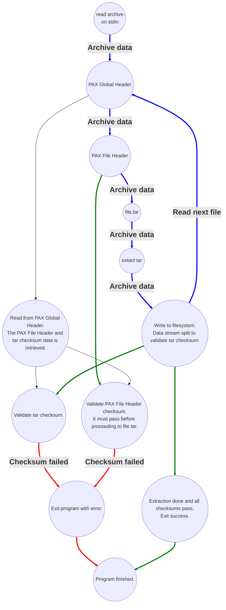

# Cache integrity checking details

Cache integrity checking is optional.  The archive created by this feature is
called an "integrity checking archive".  This is a feature specific to
`clache.sh` and not standard for the PAX tar file format.

Not all storage solutions where a cache archive would be stored can guarantee
integrity.  `clache.sh` supports a balance of speed and accuracy depending on
your use case.

Features:

- Resulting archive is a standard PAX tar format archive so you can use `tar`
  commands to interact with the archive without `clache.sh` script.
- Integrity checksums on extraction only operate on streams with very little
  data touching disk.  The streamed integrity checking is a feature of
  `clache.sh` itself.
- Archive integrity checking guarantees the cache file was not corrupted after
  its creation.
- Avoids double-writing data to disk while calculating checksums.  Checksums
  calculated via data stream.

Notable drawbacks:

- Integrity checking archives are slower to process compared to archives with no
  integrity checking.  However, the purpose here is verifying correctness of
  data at a slight time cost.
- Checksums are calculated at the same time as extraction.  Checksum results are
  only known after an archive is fully extracted.  If there was corruption
  detected, then the corruption was already written to the OS disk.  This script
  is intended for CI systems with ephemeral infrastructure (one time use;
  deleted after use).  If this is a problem for your use case, then file a
  GitHub issue and describe why.

Benchmarks for different algorithms are available later in this document.

Supported algorithms (choose one at creation time):

- [xxHash] - `./clache.sh --xxh [0|1|2|3]` extremely fast non-cryptographic hash
  algorithm.
- [SHA] - `./clache.sh --sha [1|256]` provides cryptographic integrity checking.
  sha1 available for speed/general availability at the cost of security.
  sha2-sha256 is recommended for the most secure and correct integrity checking.

[xxHash]: https://github.com/cyan4973/xxhash
[SHA]: https://en.wikipedia.org/wiki/Secure_Hash_Algorithms

xxhash is not usually available by default.  Install it depending on your
system.

```bash
# Debian/Ubuntu-like
sudo apt install xxhash

# Fedora-like
sudo dnf install xxhash

# macOS
brew install xxhash
```

## Creating an archive

`clache.sh` will create an integrity checking archive if you provide one of the
following options when creating an archive.  Integrity checking is automatic
when extracting an archive.

- `-a 1` or `--sha 1` creates a SHA1 validated archive.  `--sha 256` is also
  supported.
- `-H 1` or `--xxh 1` creates an xxHash validated archive.  xxHash `0-3`
  supported.
- `-s` or `--verify-checksum`.

Example for a maven project assuming there's no sensitive data in maven config.

    clache.sh -c -n -s ~/.m2 target > clache-archive.tar

If you wanted to inspect the archive yourself, then here's a small example.  The
following `dd` command will read the PAX Global Header (first 2 blocks), the PAX
File Header (next 2 blocks), and the `ustar` file entry (next 1 block).  Tar is
in 512-byte blocks.

    dd if=clache-archive.tar bs=512 count=5 iflag=fullblock status=none | \
    hexdump -C

## Diagram of how archive data flows through clache.sh

This diagram showcases how data flows through `clache.sh` while avoiding writing
to disk.  An archive stream is processed via stdin and integrity checking
happens alongside extraction.  For large archives with an expensive checksum
algorithm, the checksumming could slightly slow down how fast data is extracted.
`xxhsum` support is available to minimize the performance penalty of integrity
checking.



## Checksum benchmarks

Hardware

- CPU 4C 8T: Intel(R) Core(TM) i7-8565U CPU @ 1.80GHz; 4C 8T
- RAM: SK Hynix GKE160SO102408-2400 DDR4-2400 SODIMM (2x16GB) 32GB
- Storage: NVMe disk OCZ Technology Group, Inc. RD400/400A SSD 256GB PCIe x4
- Filesystem: ext4 on lvm luks-encrypted filesystem.

Benchmark code is in [benchmark.sh](benchmark.sh).  Note: it will create a 10GB
file in your home directory at `~/10gb`.

This small one-liner will run all benchmarks at once.

```bash
time ( ./docs/benchmark.sh big 2>&1 && ./docs/benchmark.sh small 2>&1; ) > log 2>&1
```

`./docs/benchmark.sh large` (~10GB of large file data; 10737438720 bytes):
repeated 3 times and fastest time for each entry taken.

| Algoritm      | Creation time | Extraction time |
| ------------- | ------------- | --------------- |
| None          | 1m11.7s       | 33.9s           |
| xxhsum -H0    | 1m18.7s       | 38.3s           |
| xxhsum -H1    | 55.6s         | 30.3s           |
| xxhsum -H2    | 53s           | 35.8s           |
| xxhsum -H3    | 1m12.9s       | 32.9s           |
| shasum -a 1   | 1m39.1s       | 46.9s           |
| shasum -a 256 | 1m59s         | 1m12.3s         |

`./docs/benchmark.sh small`  (~105MB of small file data; 1057525760 bytes):
repeated 3 times and fastest time for each entry taken.

| Algoritm      | Creation time | Extraction time |
| ------------- | ------------- | --------------- |
| None          | 14.2s         | 11s             |
| xxhsum -H0    | 15.9s         | 10.6s           |
| xxhsum -H1    | 15.3s         | 9.5s            |
| xxhsum -H2    | 18.2s         | 10.3s           |
| xxhsum -H3    | 12.7s         | 10s             |
| shasum -a 1   | 16.6s         | 11.6s           |
| shasum -a 256 | 15.5s         | 11.2s           |

## Logic explanation of integrity checking archive

There's not an easy way to generate PAX Global Headers and so this section
helped me to write the logic and manually generate the binary data necessary for
this feature.

Creation procedure if checksum enabled:

- Both the archive and file PAX File Header for the archive exist during
  creation.
- Create a PAX Global Header with a checksum data contained therin. Both PAX
  File Header checksum (`pax_chk`) and tar archive checksum (`fil_chk`)
  are generated.
- Write out: PAX Global Header, PAX File Header, the archive.

Validation procedure for each archive encountered if checksum enabled:

- If PAX Global Header encountered, then read it.
- If checksum enabled and PAX Global Header does not exist, then exit in error.
- Read checksum data for both PAX File Header and archive.
- If either PAX File Header or archive checksums do not exist, then exit in
  error.  Exception: `ustar` format files do not have a PAX File Header so
  `pax_chk` validation is skipped.
- Read the PAX File Header.  Calculate its checksum and compare against
  `pax_chk`.
- If PAX File Header checksum failed, then exit `clache.sh` in error.
- Read and extract (via `tee` to split) the archive.  Checksum calculates on the
  fly and is compared against `fil_chk`.
- If archive checksum failed, then exit in error.
- Proceed to next file if all integrity checks passed.  Or exit if no more
  files.

The structure of this integrity-based archive is very strict. Blocks out of
order is considered corruption and `clache.sh` will exit in error (e.g. if a PAX
Global Header is encountered after the PAX File Header, there will be an error
surfaced even if checksum is not required).

## PAX Global Header binary block values

The PAX Global Header (including data body) is 1KB.  The following are the
values of first 512-byte block.  All values are static unless noted outside of
the table.  The second 512-byte block is detailed in the next section.

| Field Name | offset | length | value                                      |
| ---------- | ------ | ------ | ------------------------------------------ |
| name       | 0      | 100    | `pax_global_integrity_header` (+nul 73 bs) |
| mode       | 100    | 8      | `0000666` (+nul)                           |
| uid        | 108    | 8      | `0000000` (+nul)                           |
| gid        | 116    | 8      | `0000000` (+nul)                           |
| size       | 124    | 12     | `00000000000` (+nul)                       |
| mtime      | 136    | 12     | `00000000000` (+nul)                       |
| chksum     | 148    | 8      | `00000000`                                 |
| typeflag   | 156    | 1      | `g`                                        |
| linkname   | 157    | 100    | (+nul 100 bs)                              |
| magic      | 257    | 6      | ustar (+nul)                               |
| version    | 263    | 2      | `00`                                       |
| uname      | 265    | 32     | `root` (+nul 28 bs)                        |
| gname      | 297    | 32     | `root` (+nul 28 bs)                        |
| devmajor   | 329    | 8      | `0000000` (+nul)                           |
| devminor   | 337    | 8      | `0000000` (+nul)                           |
| prefix     | 345    | 155    | (+nul 100 bs)                              |

Table notes:

1. `size` can vary depending on the checksum algorithm used.
2. `mtime` is populated when the archive was created via `date +%s` converted to
   octal.
3. `chksum` varies because `mtime` is always different and `size` is different
   with different algorithms.

The PAX Global Header is both the above 512-byte block followed by the data body
512-byte block noted in the next section which contains PAX records
(key-values).

### PAX Global Header data body

The data body contains PAX record data.  PAX record data is key-value data.

The following are PAX records and their values:

- `pax_chk` contains a checksum of the PAX File Header data (its the body which
  can contain records like `size` and `path` for an archive).  PAX File Headers
  are small amounts of data (1KB normally).  PAX File Headers provide byte size
  information for archives larger than 10GB.  It's important to know the
  integrity of the `size` before reading the archive data up to `size` via
  stdin.
- `fil_chk` contains a checksum of the entire archive data following this
  header.  This could be verifying hundreds of megabytes or even gigabytes; the
  cache data itself.

The following is a sample of a PAX record data body.

```
25 pax_chk=some checksum
25 fil_chk=some checksum
```

Generic format:

```
record_size_bs field_name=field_value
```

It's not always guaranteed that there's a PAX File Header entry for an inner
archive.  Sometimes inner archives are plain `ustar` format.  For plain `ustar`
entries, the checksum record is always `10 pax_chk=0\n`.  `pax_chk=0` is not
used by any logic.  It's just a short record.

## Additional notes

- For each inner archive, there's a both integrity and metadata information.
  The following explains the general archive format.
- A `clache.sh` archive serially contains:
  - A PAX Global Header (with checksum data for the next header and archive).
  - Optionally followed by a PAX File Header.
  - Followed by the archive (e.g. `os-cache.tar`).
  - A PAX Global Header (with checksum data for the next header and archive)
  - Optionally followed by a PAX File Header.
  - Followed by the archive (e.g. `pwd-cache.tar`).
- The archive is valid and viewable via standard utilities like `tar -tf`.
- If an extraction fails due to integrity checksum failure, then all files
  touched in the OS by the archive extraction should be considered corrupted.
  This quirk is because extraction and checksum validation are simultaneously
  streamed to avoid double-writing large amounts of data to disk.
- `clache.sh` exits non-zero which should cause a CI failure in automated build
  systems.  It writes informational logs to stderr.  If creating archives, it
  writes archive data to stdout.
